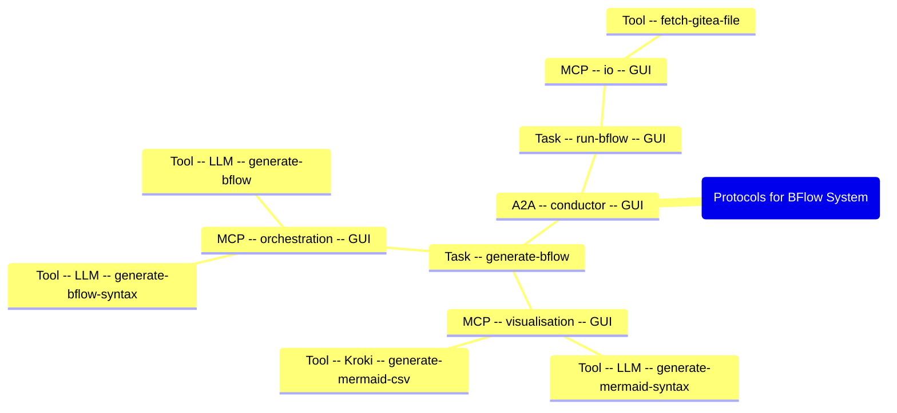

import { Code } from '@astrojs/starlight/components';
import Mermaid from '../../../components/Mermaid.astro';

export const pseudo = `
(1) Generate the BFlow Control for operating the Flow Description:
    Input: 
        Flow Description > GUI > Svelte Component
    Output: 
        BFlow
    Protocol: A2A "conductor" > Task "generate-bflow"

        (1.1) (Optional) Generate Mermaid Syntax from Flow Description.:
            Input: 
                Flow Description
            Output: 
                Mermaid Code > GUI > Markdown Preview
            Protocol: MCP "visualisation" > Tool (using LLM) "generate-mermaid-syntax"

        (1.2) (Optional) Generate Mermaid Diagram from Mermaid Syntax:
            Input: 
                Mermaid Syntax
            Output: 
                Mermaid Diagram > GUI > Markdown Preview
            Protocol: MCP "visualisation" > Tool (using Kroki) "generate-mermaid-csv"

        (1.3) Generate BFlow Syntax from Flow Description (and Mermaid Code):
            Input: 
                Flow Description + Mermaid Code
            Output: 
                BFlow Syntax > GUI > Markdown Preview
            Protocol: MCP "orchestration" > Tool (using LLM) "generate-bflow-syntax"

        (1.4) Generate BFlow from BFlow Syntax.
            Input: 
                BFlow Syntax 
                List of available Resources and Tools via MCP
            Output: 
                BFlow > GUI > Svelte Component
            Protocol: MCP "orchestration" > Tool (using LLM) "generate-bflow"

(2) Run BFlow
    Input: 
        BFlow
    Output: 
        BFlow Result > GUI > Markdown Preview
    Protocol: A2A "conductor" > Task "run-bflow"

    For each Step in BFlow: e.g.
        (2.x) Fetch File from Gitea:
            Input: 
                Step Data (e.g. Gitea URL)
                Step Settings (e.g. PAT) > GUI > Form (JSFE)
            Output: 
                Step Result > GUI > Markdown Preview
            Protocol: MCP "io" > Tool "fetch-gitea-file"
`;

<Code code={pseudo} language='text' />

<Mermaid title='Protocols for BFlow System'>

</Mermaid>
