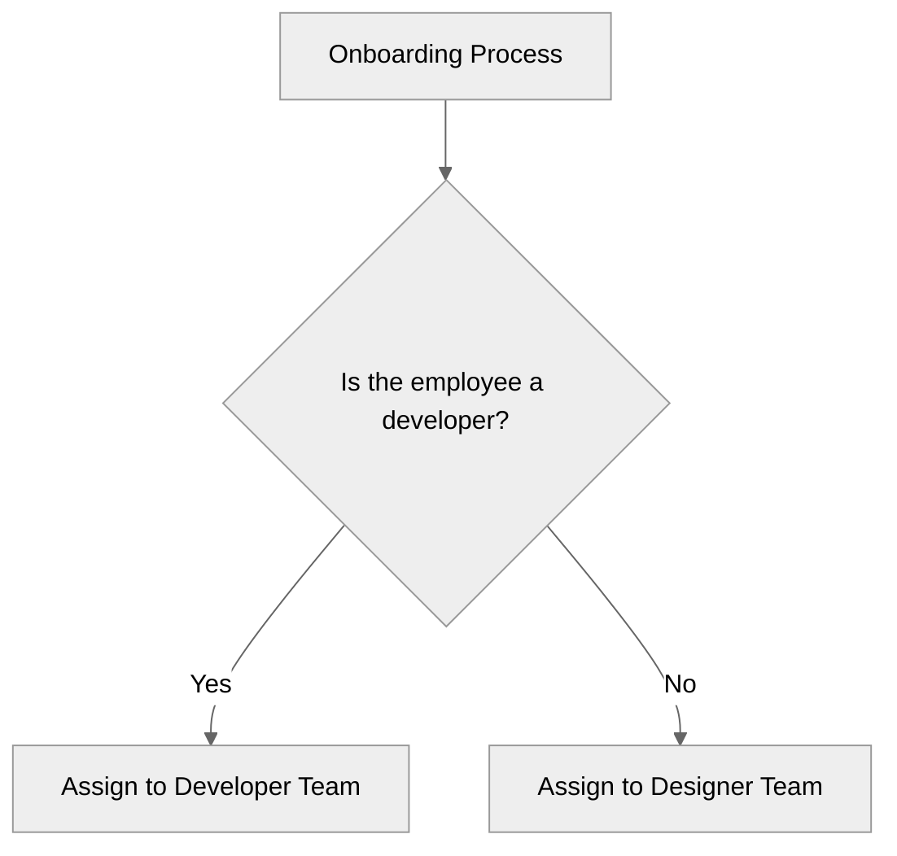

import { Code } from '@astrojs/starlight/components';
import { Steps } from '@astrojs/starlight/components';
import Mermaid from '../../../components/Mermaid.astro';

export const example1 = `
    ---
    title: Interactive Content
    description: An example of Interactive Content.
    ---
    
    
    ## Data Table
    The following table contains the list of employees:
    
    Name, Age, Position
    John Doe, 25, Developer
    Jane Doe, 23, Designer
    
    
    ## Onboarding process based on Position
    
    # Behavior Tree format for Onboarding Process:
    - SEQUENCE:
        - ...
    
    
    
`;

export const example2 = `
    ---
    title: Interactive Content
    description: An example of Interactive Content.
    cleverflow:
    - engine:
        api:
            url:
            key: 
    ---
    
    ...
    
`;
export const highlights2 = ["- engine:"];

<Mermaid title='Dummy Graph'>

</Mermaid>

## Step 1: Content Writer composes Interactive Document with Markdoc

**1.1** Users open his **Markdown Text Editor** and starts composing his Interactive Document.
<Steps>
1. Use Carta (https://github.com/BearToCode/carta) as Main Editor.
</Steps>

**1.2** Users uses simple humman readable languages i.e. Markdown, Markdoc and YAML to compose his Interactive Document.

Following is an example of his Interactive Document:
<Code code={example1} lang="markdown" title="onboarding.mdoc" />

<Steps>
2. Extend Cartar with necessary plugins to support Markdoc annd CLEVER°FLOW Tags such as `cleverflow`, `grid`, `logics`.
3. Use Datatables (https://github.com/vincjo/datatables/) to render `grid` data into a table/spreadsheet display.
4. Use Svelte Flow (https://svelteflow.dev/) to render `logics` data into a flowchart display.
</Steps>

## Step 2: Content Writer reviews his Interactive Document

**2.1** `Engine` for parsing the Interactive Document must be declated in the Frontmatter of the Interactive Document.
<Code code={example2} lang="markdown" title="onboarding.mdoc" mark={highlights2} />

**2.2** Content of the Interactive Document is parsed as the Server Side to render on the Client Side.

<Steps>
5. Use Datatables (https://github.com/vincjo/datatables/) to render `grid` data into a table/spreadsheet display.
    - Datatables supports SSR.
6. Use Svelte Flow (https://svelteflow.dev/) to render `logics` data into a flowchart display.
    - It is needed to check whether Svelte Flow supports SSR.
</Steps>

## Step 3: Content Writer test his Interactive Document

**3.1** Content Writer types into Chatfield the following query: `How Jane Doe should be onboarded?`.

**3.2** `onboarding.mdoc` is infered by the Engine for filtering the data given in `grid` and running the `logics` to provided in the `logics` to create a answer file `onboarding.run1.mdoc`:
- `onboarding.run1.mdoc` has the same structure as `onboarding.mdoc` but with the data filtered and the logics run.
- `onboarding.run1.mdoc` is rendered mostly the same like `onboarding.mdoc` but with the differernt display of the data and logics.

## Step 4: Content Writer publishes his Interactive Document

## Step 5: Engine pre-processes Interactive Document

## Step 6: Supporter uses Interactive Document

## Step 7: External Software uses Interactive Document

